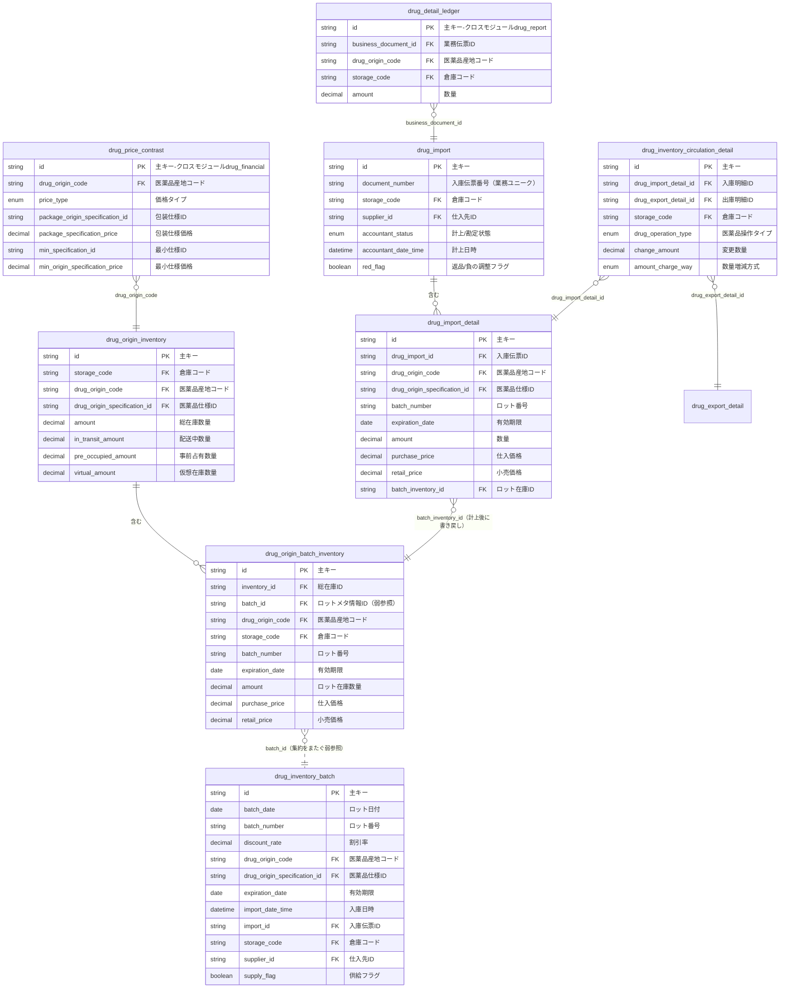
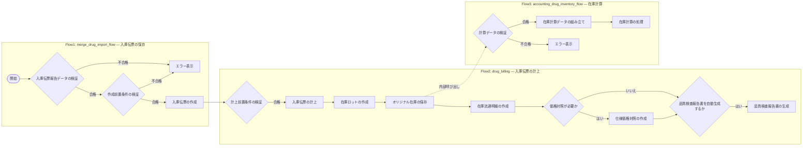
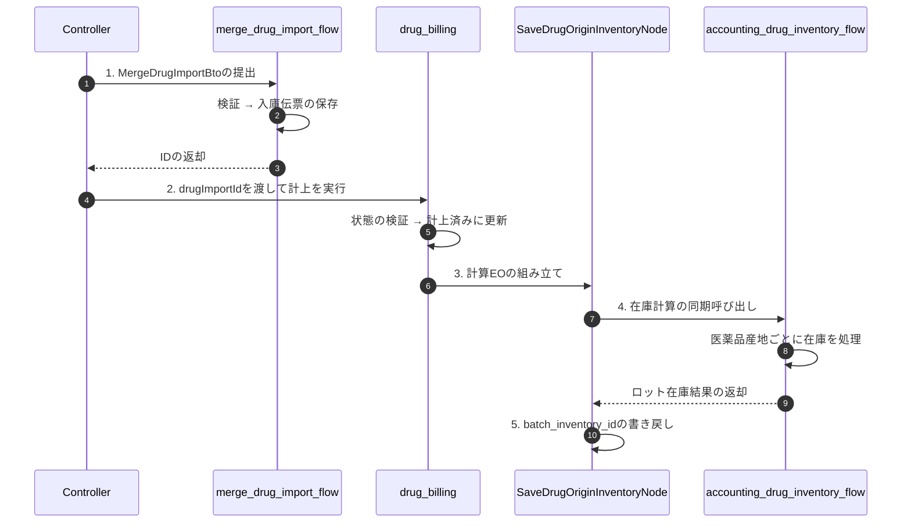

<div align="center">

<a id="top"></a>

# TocoAI ケーススタディ：HIS薬局在庫管理におけるドメインエンジニアリングの実践

<h3>大規模病院情報システムにおけるHarness Engineering導入実録</h3>

[![プロジェクト規模][scale-shield]][scale-detail]
[![効率向上][efficiency-shield]][efficiency-detail]
[![AI 採用率][adoption-shield]][adoption-detail]
[![技術スタック][stack-shield]][stack-detail]

<br/>

[← メインREADMEへ戻る][main-readme] · [DSL リファレンス][dsl-ref] · [BnB デモ →][bnb-demo]

**日本語** · [简体中文](TocoAI-HIS-DrugInventory-Case-Study.zh-CN.md) · [English](TocoAI-HIS-DrugInventory-Case-Study.md)

</div>

---

> [!TIP]
> このドキュメントは、[TocoAI メインREADME](../README.md) の **「実践ケース：大規模病院HISシステム」** セクションの詳細版です。メインドキュメントを読み終え、DSL-Spec、モデリングエンジン、FuncFlowが実際のビジネスにおいてどのような形をしているか気になる方のために書かれています。

> [!NOTE]
> 本ケーススタディは**アーキテクチャ設計とコードデリバリー**に焦点を当てており、インストールや設定のチュートリアルではありません。DTO、WritePlan、ReadPlanなどの基本概念を先に[BnB デモプロジェクト](https://tocoai.dev/docs/your-first-toco-project)で理解しておくことをお勧めします。よりスムーズな読み進めが可能になります。

<details>
<summary><kbd>目次</kbd></summary>

- [ケーススタディ概要](#overview)
- [背景と課題](#scenario)
  - [要件の説明](#requirements)
  - [主な課題](#challenges)
- [TocoAI によるソリューション](#solution)
  - [ドメインモデル](#domain-model)
  - [Write Plan と Read Plan](#read-write-plan)
  - [フローOrchestration](#flow-orchestration)
- [コアコード](#core-code)
  - [ファイル構成](#file-structure)
  - [BTO（自動生成）](#bto-auto-generated)
  - [Controller（開発者による拡張）](#controller)
  - [Flow Node（AIによる補完）](#flow-nodes)
- [導入効果](#results)
  - [従来のHISとの比較](#traditional-his)
  - [汎用AIツールとの比較](#ai-tools-comparison)
- [関連資料](#further-reading)

</details>

---

> [!TIP]
> **TL;DR**：本ケーススタディでは、TocoAIが120以上のモジュールを持つ大規模病院HISシステムにおいて、DSL-Specとモデリングエンジンを用いて薬局在庫管理モジュールのアーキテクチャを実現した方法を紹介します。コアAPI `POST /api/drug-inventory/merge-drug-import-billing` の構造コードの約 **80% はエンジンによって安定的に生成**され、残りの **20% のビジネスロジックはAIが補助し、開発者がレビューして確定**しました。最終的にAIコードの採用率は **97%** に達しました。

<a id="overview"></a>

## ケーススタディ概要

| 項目 | 内容 |
|:---|:---|
| **プロジェクト** | 某大規模医療機関の次世代HIS（病院情報システム） |
| **モジュール** | 薬局在庫管理 — 医薬品サプライチェーンの中核ハブ |
| **規模** | 120+ コアモジュール · 200+ ビジネスフロー · 800+ 機能画面 |
| **コアAPI** | `POST /api/drug-inventory/merge-drug-import-billing`（入庫伝票の保存と計上） |
| **技術パラダイム** | DSL-Spec でアーキテクチャを定義 → モデリングエンジンが80%の構造コードを生成 → AI＋開発者が20%のビジネスロジックを完成させる |

> [!NOTE]
> **コードについて**：本ケーススタディは実際の商業プロジェクトに基づいています。掲載されているDSL-Spec、ER図、コードスニペットは教育目的で簡略化しており、一部の機微なフィールドおよび完全なソースコードは公開されていません。

---

<a id="scenario"></a>

## 背景と課題

薬局在庫管理は医薬品サプライチェーンの中核ハブであり、入庫、在庫、出庫、計算までの医薬品ライフサイクル全般を管理します。本文は**小さな窓から大きな景色を見る**という趣旨で、典型的かつ複雑な「入庫伝票の保存と計上」APIを通じて、TocoAIが実際のビジネスにおける実装チェーンを完全に紹介します。

<a id="requirements"></a>

### 要件の説明

**コアAPI**：`POST /api/drug-inventory/merge-drug-import-billing`は、医薬品入庫伝票を保存し、直ちに**計上（転記）**を実行して、調達から在庫へのフローを完了させます。本APIは通常入庫と返品相殺の両方をサポートしており、両者のフローは同一ですが、数量と金額の方向のみが異なります。

**主要なビジネスルール**：
- **伝票の完全性**：ヘッダー（入庫伝票番号、倉庫、仕入先）と明細行（医薬品、ロット、数量、価格）は同時に提出する必要がある
- **請求書番号の長さ制限**：請求書番号は20文字を超えてはならない
- **状態制約**：**計上待ち**状態の伝票のみが計上を実行できる。計上後は不可逆
- **ロットの自動マッチング**：ロット番号＋有効期限に基づいて、ロット在庫レコードを自動的にマッチングまたは作成する
- **トランザクション整合性**：伝票の保存、状態の更新、在庫計算は**単一トランザクション**内で完了する必要があり、いずれかの段階で失敗すると全てロールバックされる

<a id="challenges"></a>

### 主な課題

| 課題 | 説明 |
|:---|:---|
| **複数エンティティの強い整合性変更** | 伝票、在庫、明細は、単一のトランザクションボーダー内で協調して更新される必要がある |
| **ロット在庫の冪等性を保った作成** | ロット番号＋有効期限で自動的にマッチングまたは作成し、並列計上による重複作成を防ぐ |
| **全量ルールのバッチ検証** | 計上前に完全性、状態、金額などの複数検証をバッチ実行し、即座に失敗させる必要がある |

---

<a id="solution"></a>

## TocoAI によるソリューション

<a id="domain-model"></a>

### ドメインモデル

以下のER図は、本APIと直接関連する8つのコアテーブルとその関連関係、主要フィールドを示しています：



> [!NOTE]
> `drug_detail_ledger`（drug_report モジュール）と `drug_price_contrast`（drug_financial モジュール）はクロスモジュールエンティティであり、RPCを介して呼び出されます。
>
> 下図はTocoAIビジュアルプラットフォームにおける実際の設計画面です：
>
> <p align="center">
>   
>   <br/>
>   <em>図 1：TocoAI ビジュアルプラットフォームにおけるERモデル設計画面</em></p>

**コア集約**：

| 集約 | ドメインオブジェクト（集約ルート / 子エンティティ） | 責務 |
|:---|:---|:---|
| `drug_import` | `drug_import` / `drug_import_detail` | 入庫伝票および明細の管理 |
| `drug_inventory_batch` | `drug_inventory_batch` | ロットメタ情報の管理 |
| `drug_origin_inventory` | `drug_origin_inventory` / `drug_origin_batch_inventory` | 医薬品産地在庫およびロット在庫の計算 |
| `drug_inventory_circulation_detail` | `drug_inventory_circulation_detail` | 在庫流通明細の記録 |
| `drug_detail_ledger`（クロスモジュール） | `drug_detail_ledger` | 医薬品明細元帳 |
| `drug_price_contrast`（クロスモジュール） | `drug_price_contrast` | 医薬品価格対照 |

<details>
<summary>集約設計の説明</summary>

`drug_import`、`drug_inventory_batch`、および `drug_origin_inventory` は、同一トランザクション内で計上を完了するために協調しますが、**変更頻度**と**ライフサイクル**に基づいて3つの独立した集約に分割されています：
1. **drug_import 集約**：入庫伝票の作成後、状態はほぼ固定され、主な変更は計上状態の更新です。
2. **drug_inventory_batch 集約**：ロットメタ情報（ロット番号、有効期限、仕入先など）は作成後ほぼ不変であり、グローバルな参照として機能します。
3. **drug_origin_inventory 集約**：在庫データは継続的に累積変更され、動的な数量と価格を管理します。

ロットメタ情報とロット在庫は、`drug_origin_batch_inventory.batch_id`（文字列型、JPAの`@ManyToOne`ではなく）を介して**集約をまたぐ弱参照**を形成し、両者が独立して進化できるよう、密結合を回避しています。これはDDD集約設計の中核的な原則を体現しています — **トランザクションボーダー、不変性ルール、ライフサイクルに基づいて分割し、単純にデータテーブルで分割するのではない**ということです。

`drug_inventory_circulation_detail` は独立したクエリシナリオ（履歴追跡、監査レポート）と独自のライフサイクルを持っています。これは在庫計算プロセスから生成された**永続化されたドメインイベント**と見なすことができます。

**コアリレーションシップチェーン**：入庫明細の計上後、`batch_inventory_id`を介してロット在庫に書き戻されます。ロット在庫は`batch_id`によってロットメタ情報を弱参照します。流通明細は入出庫のフローを記録します。明細元帳と価格対照は、それぞれRPCを介してdrug_reportモジュール、drug_financialモジュールと相互作用します。

</details>

<a id="read-write-plan"></a>

### Write Plan と Read Plan

#### BTO Write Plan

`merge_drug_import` Write Planは、入庫伝票保存のためのBTO（Business Transfer Object）パラメータ構造および集約書き込みロジックを定義しています：

```json
{
  "writePlan": {
    "name": "merge_drug_import",
    "aggregateRoot": "drug_import",
    "operations": [
      {
        "entity": "drug_import",
        "action": "CREATE_ON_DUPLICATE_UPDATE",
        "uniqueKey": ["id"],
        "fields": [
          "document_number", "storage_code", "export_import_id",
          "accountant_status", "red_flag", "supplier_id", "import_date", "remark"
        ]
      },
      {
        "entity": "drug_import_detail",
        "action": "FULL_MERGE",
        "uniqueKey": ["id"],
        "fields": [
          "drug_origin_code", "amount", "batch_number", "expiration_date",
          "purchase_price", "retail_price", "invoice_code", "supplier_id"
        ]
      }
    ]
  }
}
```

> [!NOTE]
> 上記のJSONは教育目的で簡略化されています。実際のWritePlanには、`drug_import` の35フィールドと `drug_import_detail` の52フィールド（汎用監査フィールドを含む）が含まれており、完全なSpecはTocoAIビジュアル設計プラットフォームで定義されています。

モデリングエンジンは自動的に `MergeDrugImportBto.java` および完全な書き込みチェーンコードを生成します。このWrite Planは約 **5,600行** で、コアファイルは以下を含みます：

- `MergeDrugImportBto.java`（約 1,000行）
- `DrugImportBOService.java`（約 930行）
- `BaseDrugImportBOService.java`（約 3,670行）
- `DrugImportBO.java`（約 40行）

`merge_drug_import` Write Planのビジュアルプラットフォームでの設定スクリーンショットは以下の通りです：

<p align="center">
  
  <br/>
  <em>図 2：TocoAI ビジュアルプラットフォームにおけるWritePlan設定画面</em></p>

#### QTO Read Plan

`search_drug_import` Read Planは、入庫伝票クエリのためのQTO（Query Transfer Object）条件を定義します。返却オブジェクトにはマスターデータと明細データが含まれます：

```json
{
  "readPlan": {
    "name": "search_drug_import",
    "returnDto": "drug_import_with_detail_dto",
    "paginationType": ["waterfall"],
    "query": "import_date >= #importDateBiggerThanEqual AND ... AND export_import.way_code in #exportImportWayCodeIn",
    "defaultOrder": [
      { "field": "document_number", "direction": "DESC" },
      { "field": "export_import.sort_number", "direction": "ASC" }
    ]
  }
}
```

> [!NOTE]
> `search_drug_import` Read PlanはWrite Planと同一のドメインモデルを共有しています。主に入庫伝票一覧ページ、状態フィルタリングなどのクエリシナリオにサービスを提供し、TocoAIのマルチテーブルJoin、サブクエリ、ページネーションのサポートを示しています。

モデリングエンジンは自動的に `SearchDrugImportQto.java`、QueryService、DAO、MyBatis SQL、およびDTO/VO変換コードを生成します。Read Planは約 **1,300行** で、コアファイルは以下を含みます：

- `SearchDrugImportQto.java` / `SearchDrugImportQtoDao.java`（クエリオブジェクトとSQL）
- `DrugImportWithDetailDtoQueryService.java`（クエリサービス）
- `DrugImportWithDetailDto.java` / `Vo` / `Converter`（DTO/VO変換）

対応するRead Plan設定画面：

<p align="center">
  
  <br/>
  <em>図 3：TocoAI ビジュアルプラットフォームにおけるReadPlan設定画面</em></p>

<a id="flow-orchestration"></a>

### フローOrchestration

上記の3大課題に対処するため、入庫伝票の保存と計上は3つのFuncFlowに分解され、`DrugInventoryFlowService` によって統一的にOrchestrationされています。各段階のコアアクションと開発者が追加したコード量は以下の通りです：



> [!NOTE]
> `drug_billing` フローのビジュアルOrchestrationプラットフォームでのデザイン効果：
>
> <p align="center">
>   
>   <br/>
>   <em>図 4：TocoAI ビジュアルプラットフォームにおけるFuncFlow Orchestration画面</em></p>

| 段階 | Flow | コアアクション | 開発者追加コード |
|:---:|:---|:---|:-------:|
| 1 | `merge_drug_import_flow` | 入庫伝票の検証と保存 | ~120行 |
| 2 | `drug_billing` | 計上と在庫計算サブフローのトリガー | ~500+行 |
| 3 | `accounting_drug_inventory_flow` | 医薬品産地ごとに在庫計算を処理 | ~430行 |

以下のシーケンス図は、コアAPIの呼び出しチェーンを示しています：



> [!IMPORTANT]
> **トランザクションボーダー**：`mergeDrugImportBilling` などの書き込みAPIはController層で`@Transactional`を統一的に付与し、全体の呼び出しチェーンが同一トランザクション内で実行されます。

> [!NOTE]
> **バッチ最適化**：`SaveDrugOriginInventoryNode` は在庫計算サブフローを呼び出す前に、医薬品コードをバッチで抽出し、RPCを介して医薬品仕様情報を一度にクエリし、N+1クエリを回避します。同時に、在庫計算EOを統一的に組み立てて `accounting_drug_inventory_flow` に提出して処理します。

<div align="right"><a href="#top">⬆️ トップへ戻る</a></div>

---

<a id="core-code"></a>

## コアコード

以下のファイルパスでは、プレースホルダー `{module-java}` を `src/main/java/com/his/drug_inventory/` の代わりに使用します。

<a id="file-structure"></a>

### ファイル構成

```text
modules/drug_inventory/
├── entrance/web/{module-java}/entrance/web/controller/DrugImportCustomBOController.java
├── service/{module-java}/
│   ├── service/bto/MergeDrugImportBto.java
│   ├── service/flow/node/merge_drug_import_flow/
│   │   └── ValidateCreateDrugImportPreconditionNode.java
│   ├── service/flow/node/drug_billing/
│   │   ├── DrugBillingNode.java
│   │   └── SaveDrugOriginInventoryNode.java
│   └── service/query/DrugImportWithDetailDtoQueryService.java
├── manager/{module-java}/
│   ├── manager/bo/DrugImportBO.java
│   ├── manager/dto/DrugImportWithDetailDto.java
│   └── manager/converter/DrugImportWithDetailDtoConverter.java
└── persist/{module-java}/
    ├── persist/dos/DrugImport.java
    ├── persist/mapper/SearchDrugImportQtoDao.java
    └── persist/eo/InventoryAccountingConversionEo.java
```

<a id="bto-auto-generated"></a>

### BTO（自動生成）

`MergeDrugImportBto.java` は `merge_drug_import` Write Planから自動生成されます。**手動での変更は禁止**されています：

```java
// service/{module-java}/service/bto/MergeDrugImportBto.java
@Getter
@NoArgsConstructor
public class MergeDrugImportBto {
    private String id;
    private String documentNumber;
    private String storageCode;
    private AccountantStatusEnum accountantStatus;
    private Boolean redFlag;
    private String supplierId;
    private Date importDate;
    private String remark;
    @Valid
    private List<DrugImportDetailBto> drugImportDetailBtoList;

    @Getter
    @NoArgsConstructor
    public static class DrugImportDetailBto {
        private String id;
        private String drugOriginCode;
        private BigDecimal amount;
        private String batchNumber;
        private Date expirationDate;
        private BigDecimal purchasePrice;
        private BigDecimal retailPrice;
        private String invoiceCode;
        private String supplierId;
        // ... その他の自動生成フィールドおよびsetter
    }
}
```

<a id="controller"></a>

### Controller（開発者による拡張）

`DrugImportCustomBOController` は `@AutoGenerated(locked = false)` を使用しており、開発者は生成されたスケルトン内でビジネスロジックを追加できます：

```java
// entrance/web/{module-java}/entrance/web/controller/DrugImportCustomBOController.java
@Controller
@Validated
public class DrugImportCustomBOController {

    @Resource
    private DrugInventoryFlowService drugInventoryFlowService;

    /** 
     * 入庫伝票の保存と計上
     * API UUID: 516bb19b-7c30-4830-b69e-7e5269e0cce0
     */
    @PublicInterface(id = "516bb19b-7c30-4830-b69e-7e5269e0cce0", version = "1745558557764")
    @AutoGenerated(locked = false, uuid = "516bb19b-7c30-4830-b69e-7e5269e0cce0")
    @RequestMapping(value = "/api/drug-inventory/merge-drug-import-billing", method = RequestMethod.POST)
    @Transactional
    public String mergeDrugImportBilling(@Valid @NotNull MergeDrugImportBto bto) {
        // 段階1：入庫伝票の保存
        MergeDrugImportFlowContext ctx1 = new MergeDrugImportFlowContext();
        ctx1.setMergeDrugImportBto(bto);
        drugInventoryFlowService.invokeMergeDrugImportFlow(ctx1);

        // 段階2：計上の実行
        DrugBillingContext ctx2 = new DrugBillingContext();
        ctx2.setDrugImportId(ctx1.getMergeDrugImportBto().getId());
        drugInventoryFlowService.invokeDrugBilling(ctx2);

        return ctx1.getMergeDrugImportBto().getId();
    }
}
```

<a id="flow-nodes"></a>

### Flow Node（AIによる補完）

> 以下は、本ケーススタディのAPIに関連するコアFlow Nodeコードの一部抜粋に過ぎません。実際の完全なフローには、より多くの前置条件検証、状態遷移、イベント送信などのNodeが含まれています。商業プロジェクトであるため、ここでは完全なソースコードを展開していません。

<details>
<summary>前置条件検証Node：ValidateCreateDrugImportPreconditionNode</summary>

```java
// service/{module-java}/service/flow/node/merge_drug_import_flow/ValidateCreateDrugImportPreconditionNode.java
@Component("drugInventory-mergeDrugImportFlow-validateCreateDrugImportPrecondition")
public class ValidateCreateDrugImportPreconditionNode extends NodeIfComponent {

    public boolean processIf() {
        MergeDrugImportFlowContext context = getFirstContextBean();
        MergeDrugImportBto bto = context.getMergeDrugImportBto();

        // 入庫伝票明細の請求書番号長さは20文字を超えてはならない
        for (var detail : bto.getDrugImportDetailBtoList()) {
            var invoiceCode = detail.getInvoiceCode();
            if (StrUtil.isNotBlank(invoiceCode) && invoiceCode.length() > 20) {
                throw new IgnoredException(
                    ErrorCode.WRONG_PARAMETER,
                    detail.getOriginDrugName() + "：入庫伝票明細の請求書番号は20文字を超えてはいけません"
                );
            }
        }

        // ... 実際には毒理タイプの整合性チェックなど、約80行の追加ビジネスロジックがあります

        return true;
    }
}
```

</details>

<details>
<summary>計上Node：DrugBillingNode</summary>

```java
// service/{module-java}/service/flow/node/drug_billing/DrugBillingNode.java
@Component("drugInventory-drugBilling-drugBilling")
public class DrugBillingNode extends NodeComponent {

    @Resource
    private DrugImportBOService drugImportBOService;
    @Resource
    private DrugImportWithDetailDtoService drugImportWithDetailDtoService;

    public void process() {
        DrugBillingContext ctx = getFirstContextBean();

        // 入庫伝票明細のクエリ
        DrugImportWithDetailDto drugImportWithDetailDto =
                drugImportWithDetailDtoService.getById(ctx.getDrugImportId());
        Assert.notNull(drugImportWithDetailDto, "入庫伝票が存在しません");

        // 状態の検証：「計上待ち」である必要がある
        Assert.isTrue(
            AccountantStatusEnum.WAIT_ACCOUNTANT.equals(
                drugImportWithDetailDto.getAccountantStatus()),
            "入庫伝票の状態が計上待ちではないため、計上を実行できません"
        );

        // ダウンストリームNodeにコンテキストを渡す
        ctx.setDrugImportWithDetailDto(drugImportWithDetailDto);

        // 伝票状態を「計上済み」に更新
        UpdateDrugImportBto updateBto = new UpdateDrugImportBto();
        updateBto.setId(drugImportWithDetailDto.getId());
        updateBto.setAccountantStatus(AccountantStatusEnum.ACCOUNTANT);
        updateBto.setAccountantDateTime(new Date());
        drugImportBOService.updateDrugImport(updateBto);
    }
}
```

</details>

<details>
<summary>在庫計算Node：SaveDrugOriginInventoryNode</summary>

```java
// service/{module-java}/service/flow/node/drug_billing/SaveDrugOriginInventoryNode.java
@Component("drugInventory-drugBilling-saveDrugOriginInventory")
public class SaveDrugOriginInventoryNode extends NodeComponent {

    @Resource
    private DrugInventoryFlowService drugInventoryFlowService;
    @Resource
    private ExportImportWayBaseDtoServiceInDrugInventoryRpcAdapter exportImportWayAdapter;
    @Resource
    private DrugImportBOService drugImportBOService;
    // ... その他の依存性注入

    public void process() {
        DrugBillingContext context = getFirstContextBean();
        DrugImportWithDetailDto dto = context.getDrugImportWithDetailDto();

        // 1. 入庫方式の取得と検証
        ExportImportWayBaseDto importWay = getAndValidateImportWay(dto);
        context.setExportImportWayBaseDto(importWay);

        // 2. 在庫増減タイプの決定（返品相殺の場合は数量を反転）
        InventoryIncreaseReduceEnum inventoryType =
                determineInventoryIncreaseReduceType(importWay, dto.getRedFlag());

        // 3. 入庫明細のバッチ処理 → 計算EOの組み立て
        String storageCode = Optional.ofNullable(dto.getStorage())
                .map(OrganizationDepartmentDto::getId)
                .orElse(null);
        List<InventoryAccountingConversionEo> eos =
                createBatchInventoryAccountingConversionEos(
                        dto.getDrugImportDetailList(), dto, storageCode, inventoryType);

        // 4. 在庫計算Flowの呼び出し
        AccountingDrugInventoryFlowContext batchCtx = new AccountingDrugInventoryFlowContext();
        batchCtx.setInventoryAccountingConversionEos(eos);
        batchCtx.setIsNeedSplitDocumentDetailByBatch(true);
        drugInventoryFlowService.invokeAccountingDrugInventoryFlow(batchCtx);

        // 5. ロットIDを入庫明細に書き戻す
        handleImportResults(batchCtx, dto.getDrugImportDetailList(), dto.getId());
    }

    private void handleImportResults(
            AccountingDrugInventoryFlowContext batchContext,
            List<DrugImportDetailDto> detailList,
            String drugImportId) {
        // 入庫明細を反復処理し、在庫計算結果からマッチングするロットを探してbatch_inventory_idを書き戻す
        // ... 実際の実装：約90行のロットマッチングおよび更新ロジック
    }
}
```

</details>

<div align="right"><a href="#top">⬆️ トップへ戻る</a></div>

---

<a id="results"></a>

## 導入効果

以下のデータは、某大規模医療機関のコアHISシステムの内部統計およびチームの振り返りから得られたものです。

<a id="traditional-his"></a>

### 従来のHISとの比較

| 指標 | 過去の類似プロジェクト（従来型開発） | TocoAI | 変化 |
|:---|:---|:---|:---|
| 開発チーム規模 | 約300名 | 約30名 | 約 **90%** 削減 |
| コードレビューコスト | 全量手動レビュー | 約20%のビジネスロジックのみレビュー | 大幅削減 |
| 新入社員の全体把握時間 | 2〜3ヶ月 | **1〜2週間** | 劇的短縮 |

> [!NOTE]
> 統計対象：800+ 機能画面、全体的な開発効率は約 **300%+** 向上しました。

<a id="ai-tools-comparison"></a>

### 汎用AIツールとの比較

TocoAIの中核的な違いは「AIがどの程度のコードを書くか」ではなく、**コード生成パラダイム**にあります。汎用AIツール（例：Cursor、Claude Code）はプロンプトと開発者の経験に依存してコード補完を行いますが、TocoAIは **DSL-Spec → モデリングエンジン** を通じて構造コードを決定論的に生成します。

| 指標 | 汎用AIコーディングツール（例：Cursor / Claude Code） | TocoAI |
|:---|:-----------------------------------|:---|
| AIコード採用率 | 約60%〜70% | **約97%** |
| 構造コードのソース | 手動作成 + AI補助に依存 | **モデリングエンジンが約80%を安定的に生成** |
| 設計とコードの整合性 | 開発者の経験やプロンプトによって変動 | DSL駆動、設計がコードである |

**主要なメリット**：決定論的な生成によりプロンプトドリフトのリスクを排除し、DSL駆動により「設計がコード」という保守性を保証します。責務分離されたNode設計は、システムの長期的な安定性をさらに向上させます。

> [!IMPORTANT]
> **限界と適用範囲：**<br>
>
> TocoAIの強みは、**長期メンテナンスが必要で、複数人の協業が求められ、アーキテクチャ規範の要求が高い複雑なサーバーサイドシステム**において最大限に発揮されます。ライフサイクルが極めて短いプロトタイプスクリプトや、構造化設計の制約を全く受け入れられないチームの場合、投資対効果はそれほど高くない可能性があります。しかし、本ケーススタディは、HISシステムがレガシー環境（SQL Server 2008 + 大量のストアドプロシージャ）からリバースエンジニアリングされた場合であっても、**モジュールごとの漸進的移行**によりスムーズに導入でき、一度に全面書き換える必要がないことを証明しています。

---

<a id="further-reading"></a>

## 関連資料

<div align="center">

[← TocoAI メインREADMEへ戻る][main-readme] · [📐 DSL-Spec リファレンスを見る][dsl-ref] · [🏠 完全なデモを見る：BnB 宿泊予約システム][bnb-demo]

</div>

---

<!-- LINK GROUP -->
[scale-shield]: https://img.shields.io/badge/プロジェクト規模-120%2B%E3%83%A2%E3%82%B8%E3%83%A5%E3%83%BC%E3%83%AB%20%C2%B7%20200%2B%E3%83%95%E3%83%AD%E3%83%BC-4B78E6?style=flat-square&labelColor=black
[scale-detail]: #-ケーススタディ概要
[efficiency-shield]: https://img.shields.io/badge/効率向上-300%25%2B-brightgreen?style=flat-square&color=73DC8C&labelColor=black
[efficiency-detail]: #-導入効果
[adoption-shield]: https://img.shields.io/badge/AI%E6%8E%A1%E7%94%A8%E7%8E%87-%E7%B4%8497%25-orange?style=flat-square&color=ffcb47&labelColor=black
[adoption-detail]: #-汎用aiツールとの比較
[stack-shield]: https://img.shields.io/badge/技術スタック-Java%20%7C%20Spring%20Boot-orange?style=flat-square&color=ffcb47&labelColor=black
[stack-detail]: #-ケーススタディ概要
[main-readme]: ../README.md
[dsl-ref]: ../assets/dsl.md
[bnb-demo]: https://tocoai.dev/docs/your-first-toco-project
