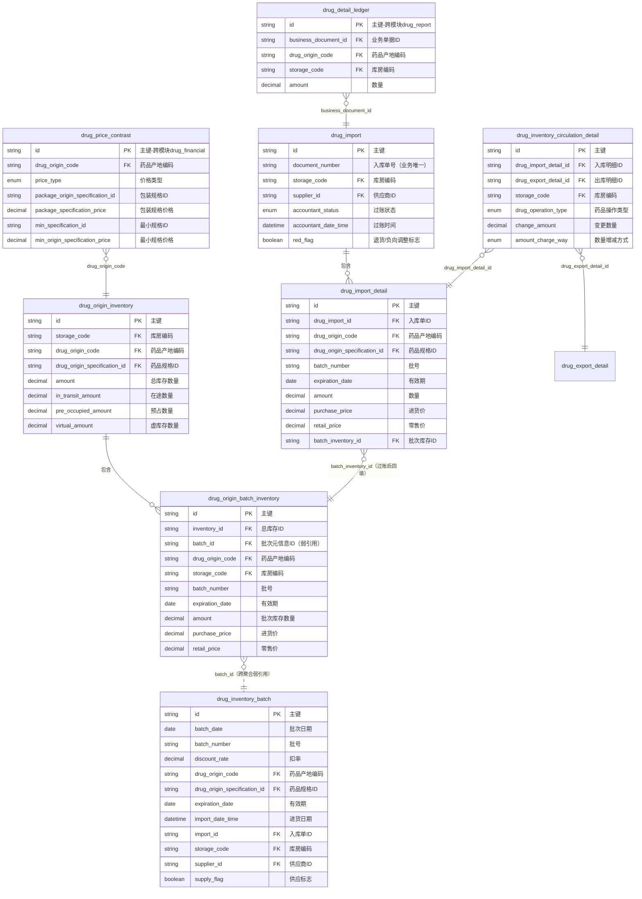
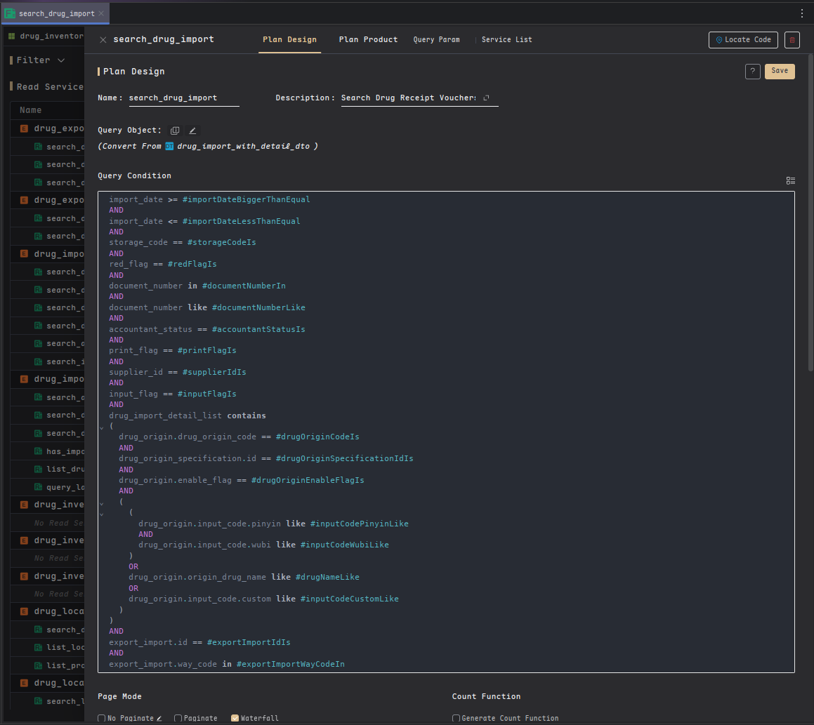
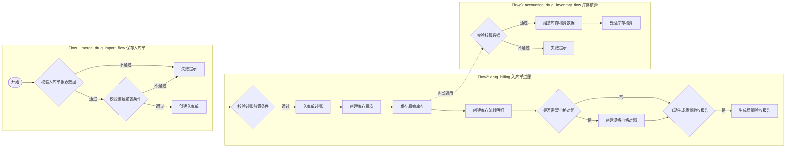
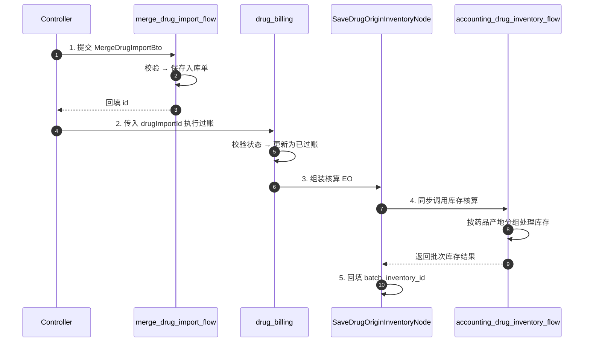

<div align="center">

<a id="top"></a>

# 🏥 TocoAI 案例：HIS 药库管理的领域工程实践

<h3>大型医院信息系统药库模块的 Harness Engineering 落地实录</h3>

[![项目规模][scale-shield]][scale-detail]
[![效率提升][efficiency-shield]][efficiency-detail]
[![AI 采纳率][adoption-shield]][adoption-detail]
[![技术栈][stack-shield]][stack-detail]

<br/>

[← 返回主 README][main-readme] · [DSL 语法参考][dsl-ref] · [BnB 演示 →][bnb-demo]

**简体中文** · [English](TocoAI-HIS-DrugInventory-Case-Stud.md) · [日本語](TocoAI-HIS-DrugInventory-Case-Study.ja-JP.md)

</div>

---

> [!TIP]
> 这是 [TocoAI 主 README](../README.md) 中 **"真实案例：大型医院 HIS 系统"** 的详细展开。如果你刚读完主文档，好奇 DSL-Spec、建模引擎和 FuncFlow 在真实业务中的形态，这个案例就是为你写的。

> [!NOTE]
> 本案例聚焦**架构设计与代码落地产出**，而非安装配置教程。建议先了解 [BnB 演示项目](https://tocoai.cn/docs/your-first-toco-project) 中的 DTO、WritePlan、ReadPlan 等基本概念，阅读体验会更流畅。

<details>
<summary><kbd>📋 目录</kbd></summary>

- [📋 案例概览](#overview)
- [🏥 场景与痛点](#scenario)
  - [📝 需求描述](#requirements)
  - [⚡ 核心挑战](#challenges)
- [⚙️ TocoAI 解决方案](#solution)
  - [📐 领域模型](#domain-model)
  - [✏️ 写方案与读方案](#read-write-plan)
  - [🔄 流程编排](#flow-orchestration)
- [💻 核心代码](#core-code)
  - [📁 文件结构](#file-structure)
  - [📦 BTO（自动生成）](#bto-auto-generated)
  - [🎮 Controller（开发者扩展）](#controller)
  - [🔧 Flow 节点（AI 补充）](#flow-nodes)
- [📊 落地效果](#results)
  - [🏛️ 与传统 HIS 对比](#traditional-his)
  - [🤖 与通用 AI 工具对比](#ai-tools-comparison)
- [📚 延伸阅读](#further-reading)

</details>

---

> [!TIP]
> **TL;DR**：本案例展示 TocoAI 如何在一个 120+ 模块的大型医院 HIS 系统中，通过 DSL-Spec 和建模引擎完成药库管理模块的架构落地。核心接口 `POST /api/drug-inventory/merge-drug-import-billing` 的 80% 结构性代码由引擎稳态生成，剩余 20% 的业务逻辑由 AI 辅助生成、开发者审阅确认，最终 AI 代码采纳率近 97%。

<a id="overview"></a>

## 📋 案例概览

| 维度 | 内容 |
|:---|:---|
| **项目** | 某大型医疗机构新一代 HIS（医院信息系统） |
| **模块** | 药库管理 — 药品供应链核心枢纽 |
| **规模** | 120+ 核心模块 · 200+ 业务流程 · 800+ 功能页面 |
| **核心接口** | `POST /api/drug-inventory/merge-drug-import-billing`（保存入库单并过账） |
| **技术范式** | DSL-Spec 定义架构 → 建模引擎生成 80% 结构代码 → AI+开发者完成 20% 业务逻辑 |

> [!NOTE]
> **关于代码**：本案例源于真实商业落地项目，文中展示的 DSL-Spec、ER 图和代码片段为教学展示已精简，部分敏感字段和完整源码未公开。

---

<a id="scenario"></a>

## 🏥 场景与痛点

药库是药品供应链的核心枢纽，负责药品从入库、库存、出库到核算的全生命周期管理。本文**以小见大**——通过一个典型、复杂的 `入库单保存并过账` 接口，完整展示 TocoAI 在真实业务中的实现链路。

<a id="requirements"></a>

### 📝 需求描述

**核心接口**：`POST /api/drug-inventory/merge-drug-import-billing`，保存药品入库单并立即执行**过账**，完成药品从采购到库存的流转。本接口同时支持正常入库和退货冲销，两者流程一致，仅数量和金额方向不同。

**关键业务规则**：
- **单据完整性**：主单据（入库单号、库房、供应商）与明细行（药品、批次、数量、价格）必须同时提交
- **发票号长度限制**：发票号不超过 20 个字符
- **状态约束**：只有**待过账**状态的单据才能执行过账，过账后不可逆
- **批次自动匹配**：根据批次号+有效期自动匹配或创建批次库存记录
- **事务一致性**：单据保存、状态更新、库存核算必须在**单一事务**中完成，任一环节失败全部回滚

<a id="challenges"></a>

### ⚡ 核心挑战

| 挑战 | 说明 |
|:---|:---|
| **多实体强一致性变更** | 单据、库存、流水明细需在单一事务边界内协同更新 |
| **批次库存幂等创建** | 按批次号+有效期自动匹配或创建批次记录，避免并发过账导致重复创建 |
| **全量规则批量校验** | 过账前需批量执行完整性、状态、金额等多重校验并快速失败 |

---

<a id="solution"></a>

## ⚙️ TocoAI 解决方案

<a id="domain-model"></a>

### 📐 领域模型

以下 ER 图展示了与该接口直接相关的 8 张核心表及其关联关系、关键字段：



> [!NOTE]
> `drug_detail_ledger`（drug_report 模块）和 `drug_price_contrast`（drug_financial 模块）为跨模块 Entity，通过 RPC 方式调用。
>
> 下图是 TocoAI 可视化平台中的实际设计界面：
>
> <p align="center">
>   
>   <br/>
>   <em>图 1：TocoAI 可视化平台中的 ER 模型设计界面</em></p>

**核心聚合**：

| 聚合 | 领域对象（聚合根 / 子实体） | 职责 |
|:---|:---|:---|
| `drug_import` | `drug_import` / `drug_import_detail` | 入库单及明细管理 |
| `drug_inventory_batch` | `drug_inventory_batch` | 批次元信息管理 |
| `drug_origin_inventory` | `drug_origin_inventory` / `drug_origin_batch_inventory` | 药品产地库存及批次库存核算 |
| `drug_inventory_circulation_detail` | `drug_inventory_circulation_detail` | 库存流通明细记录 |
| `drug_detail_ledger`（跨模块） | `drug_detail_ledger` | 药品明细账 |
| `drug_price_contrast`（跨模块） | `drug_price_contrast` | 药品价格对照 |

<details>
<summary>🔍 聚合设计说明</summary>

`drug_import`、`drug_inventory_batch` 和 `drug_origin_inventory` 在同一事务中协作完成过账，但按**变更频率**和**生命周期**划分为三个独立聚合：
1. **drug_import 聚合**：入库单创建后状态固化，主要变更为过账状态更新。
2. **drug_inventory_batch 聚合**：批次元信息（批号、有效期、供应商等）创建后基本不变，作为全局唯一参照。
3. **drug_origin_inventory 聚合**：库存数据持续累加变更，管理动态数量和价格。

批次元信息与批次库存之间通过 `drug_origin_batch_inventory.batch_id`（字符串类型，而非 JPA 的 `@ManyToOne`）建立**跨聚合弱引用**，确保两者独立演化，避免紧耦合。这体现了 DDD 聚合设计的核心原则——**按事务边界、不变性规则和生命周期划分，而不是简单按数据表划分**。

`drug_inventory_circulation_detail` 具有独立的查询场景（流水追溯、审计报表）和生命周期，可视作库存核算过程产生的**领域事件落盘**。

**核心关系链路**：入库明细过账后通过 `batch_inventory_id` 回填批次库存；批次库存通过 `batch_id` 弱引用批次元信息；流通明细记录出入库流水；明细账和价格对照分别通过 RPC 与 drug_report、drug_financial 模块交互。

</details>

<a id="read-write-plan"></a>

### ✏️ 写方案与读方案

#### BTO 写方案

`merge_drug_import` 写方案定义了入库单保存的 BTO（Business Transfer Object）参数结构及聚合写逻辑：

```json
{
  "writePlan": {
    "name": "merge_drug_import",
    "aggregateRoot": "drug_import",
    "operations": [
      {
        "entity": "drug_import",
        "action": "CREATE_ON_DUPLICATE_UPDATE",
        "uniqueKey": ["id"],
        "fields": [
          "document_number", "storage_code", "export_import_id",
          "accountant_status", "red_flag", "supplier_id", "import_date", "remark"
        ]
      },
      {
        "entity": "drug_import_detail",
        "action": "FULL_MERGE",
        "uniqueKey": ["id"],
        "fields": [
          "drug_origin_code", "amount", "batch_number", "expiration_date",
          "purchase_price", "retail_price", "invoice_code", "supplier_id"
        ]
      }
    ]
  }
}
```

> [!NOTE]
> 上述 JSON 为教学展示已精简，实际 WritePlan 包含 drug_import 的 35 个字段和 drug_import_detail 的 52 个字段（含通用审计字段），完整 Spec 由 TocoAI 可视化设计平台定义。

建模引擎自动生成 `MergeDrugImportBto.java` 及完整写链路代码，该写方案约 **5600 行**，核心文件包括：

- `MergeDrugImportBto.java`（约 1000 行）
- `DrugImportBOService.java`（约 930 行）
- `BaseDrugImportBOService.java`（约 3670 行）
- `DrugImportBO.java`（约 40 行）

`merge_drug_import` 写方案在可视化平台中的配置截图如下：

<p align="center">
  
  <br/>
  <em>图 2：TocoAI 可视化平台中的 WritePlan 配置界面</em></p>

#### QTO 读方案

`search_drug_import` 读方案定义了入库单查询的 QTO（Query Transfer Object）条件，返回对象包含主表及明细数据：

```json
{
  "readPlan": {
    "name": "search_drug_import",
    "returnDto": "drug_import_with_detail_dto",
    "paginationType": ["waterfall"],
    "query": "import_date >= #importDateBiggerThanEqual AND ... AND export_import.way_code in #exportImportWayCodeIn",
    "defaultOrder": [
      { "field": "document_number", "direction": "DESC" },
      { "field": "export_import.sort_number", "direction": "ASC" }
    ]
  }
}
```

> [!NOTE]
> `search_drug_import` 读方案与写方案共享同一套领域模型，主要服务于入库单列表页、状态筛选等查询场景，展示了 TocoAI 对多表 Join、子查询和分页的支持。

建模引擎自动生成 `SearchDrugImportQto.java`、QueryService、DAO、MyBatis SQL 及 DTO/VO 转换代码等完整读链路代码，读方案约 **1300 行**，核心文件包括：

- `SearchDrugImportQto.java` / `SearchDrugImportQtoDao.java`（查询对象与 SQL）
- `DrugImportWithDetailDtoQueryService.java`（查询服务）
- `DrugImportWithDetailDto.java` / `Vo` / `Converter`（DTO/VO 转换）

对应的读方案配置界面：

<p align="center">
  
  <br/>
  <em>图 3：TocoAI 可视化平台中的 ReadPlan 配置界面</em></p>

<a id="flow-orchestration"></a>

### 🔄 流程编排

针对上述三大挑战，入库单保存并过账被拆解为 3 个 FuncFlow，由 `DrugInventoryFlowService` 统一编排。各阶段核心动作与开发者补充代码量如下：



> [!NOTE]
> `drug_billing` 流程在可视化编排平台中的设计效果：
>
> <p align="center">
>   
  
>   <br/>
>   <em>图 4：TocoAI 可视化平台中的 FuncFlow 编排界面</em></p>

| 阶段 | Flow | 核心动作 |  开发者补充  |
|:---:|:---|:---|:-------:|
| 1 | `merge_drug_import_flow` | 校验并保存入库单 | ~120 行  |
| 2 | `drug_billing` | 过账并触发库存核算子流程 | ~500+ 行 |
| 3 | `accounting_drug_inventory_flow` | 按药品产地分组处理库存核算 | ~430 行  |

以下时序图展示了核心接口的调用链路：



> [!IMPORTANT]
> **事务边界**：`mergeDrugImportBilling` 等写接口在 Controller 层统一加 `@Transactional`，整个调用链路在同一事务中执行。

> [!NOTE]
> **批量优化**：`SaveDrugOriginInventoryNode` 在调用库存核算子流程前，会批量提取药品编码并一次性 RPC 查询药品规格信息，避免 N+1 查询；同时统一组装库存核算 EO 提交给 `accounting_drug_inventory_flow` 处理。

<div align="right"><a href="#top">⬆️ 回到顶部</a></div>

---

<a id="core-code"></a>

## 💻 核心代码

后文文件路径使用占位符 `{module-java}` 代替 `src/main/java/com/his/drug_inventory/`。

<a id="file-structure"></a>

### 📁 文件结构

```text
modules/drug_inventory/
├── entrance/web/{module-java}/entrance/web/controller/DrugImportCustomBOController.java
├── service/{module-java}/
│   ├── service/bto/MergeDrugImportBto.java
│   ├── service/flow/node/merge_drug_import_flow/
│   │   └── ValidateCreateDrugImportPreconditionNode.java
│   ├── service/flow/node/drug_billing/
│   │   ├── DrugBillingNode.java
│   │   └── SaveDrugOriginInventoryNode.java
│   └── service/query/DrugImportWithDetailDtoQueryService.java
├── manager/{module-java}/
│   ├── manager/bo/DrugImportBO.java
│   ├── manager/dto/DrugImportWithDetailDto.java
│   └── manager/converter/DrugImportWithDetailDtoConverter.java
└── persist/{module-java}/
    ├── persist/dos/DrugImport.java
    ├── persist/mapper/SearchDrugImportQtoDao.java
    └── persist/eo/InventoryAccountingConversionEo.java
```

<a id="bto-auto-generated"></a>

### 📦 BTO（自动生成）

`MergeDrugImportBto.java` 从 `merge_drug_import` 写方案自动生成，**禁止手动修改**：

```java
// service/{module-java}/service/bto/MergeDrugImportBto.java
@Getter
@NoArgsConstructor
public class MergeDrugImportBto {
    private String id;
    private String documentNumber;
    private String storageCode;
    private AccountantStatusEnum accountantStatus;
    private Boolean redFlag;
    private String supplierId;
    private Date importDate;
    private String remark;
    @Valid
    private List<DrugImportDetailBto> drugImportDetailBtoList;

    @Getter
    @NoArgsConstructor
    public static class DrugImportDetailBto {
        private String id;
        private String drugOriginCode;
        private BigDecimal amount;
        private String batchNumber;
        private Date expirationDate;
        private BigDecimal purchasePrice;
        private BigDecimal retailPrice;
        private String invoiceCode;
        private String supplierId;
        // ... 更多自动生成字段及 setter
    }
}
```

<a id="controller"></a>

### 🎮 Controller（开发者扩展）

`DrugImportCustomBOController` 使用 `@AutoGenerated(locked = false)`，开发者可在生成骨架内补充业务逻辑：

```java
// entrance/web/{module-java}/entrance/web/controller/DrugImportCustomBOController.java
@Controller
@Validated
public class DrugImportCustomBOController {

    @Resource
    private DrugInventoryFlowService drugInventoryFlowService;

    /** 
     * 保存入库单并过账
     * API UUID: 516bb19b-7c30-4830-b69e-7e5269e0cce0
     */
    @PublicInterface(id = "516bb19b-7c30-4830-b69e-7e5269e0cce0", version = "1745558557764")
    @AutoGenerated(locked = false, uuid = "516bb19b-7c30-4830-b69e-7e5269e0cce0")
    @RequestMapping(value = "/api/drug-inventory/merge-drug-import-billing", method = RequestMethod.POST)
    @Transactional
    public String mergeDrugImportBilling(@Valid @NotNull MergeDrugImportBto bto) {
        // 阶段1：保存入库单
        MergeDrugImportFlowContext ctx1 = new MergeDrugImportFlowContext();
        ctx1.setMergeDrugImportBto(bto);
        drugInventoryFlowService.invokeMergeDrugImportFlow(ctx1);

        // 阶段2：执行过账
        DrugBillingContext ctx2 = new DrugBillingContext();
        ctx2.setDrugImportId(ctx1.getMergeDrugImportBto().getId());
        drugInventoryFlowService.invokeDrugBilling(ctx2);

        return ctx1.getMergeDrugImportBto().getId();
    }
}
```

<a id="flow-nodes"></a>

### 🔧 Flow 节点（AI 补充）

> 以下仅节选了本案例接口涉及的部分核心 Flow Node 代码用于示意。实际完整流程还包含更多前置校验、状态流转、事件发送等节点，因属于商业落地项目，此处不做完整源码展开。

<details>
<summary>🔍 前置校验节点：ValidateCreateDrugImportPreconditionNode</summary>

```java
// service/{module-java}/service/flow/node/merge_drug_import_flow/ValidateCreateDrugImportPreconditionNode.java
@Component("drugInventory-mergeDrugImportFlow-validateCreateDrugImportPrecondition")
public class ValidateCreateDrugImportPreconditionNode extends NodeIfComponent {

    public boolean processIf() {
        MergeDrugImportFlowContext context = getFirstContextBean();
        MergeDrugImportBto bto = context.getMergeDrugImportBto();

        // 入库单明细发票号长度不能大于 20
        for (var detail : bto.getDrugImportDetailBtoList()) {
            var invoiceCode = detail.getInvoiceCode();
            if (StrUtil.isNotBlank(invoiceCode) && invoiceCode.length() > 20) {
                throw new IgnoredException(
                    ErrorCode.WRONG_PARAMETER,
                    detail.getOriginDrugName() + "入库单明细发票号码长度不能大于20"
                );
            }
        }

        // ... 实际还有毒理类型一致性校验等 ~80 行业务逻辑

        return true;
    }
}
```

</details>

<details>
<summary>🔍 过账节点：DrugBillingNode</summary>

```java
// service/{module-java}/service/flow/node/drug_billing/DrugBillingNode.java
@Component("drugInventory-drugBilling-drugBilling")
public class DrugBillingNode extends NodeComponent {

    @Resource
    private DrugImportBOService drugImportBOService;
    @Resource
    private DrugImportWithDetailDtoService drugImportWithDetailDtoService;

    public void process() {
        DrugBillingContext ctx = getFirstContextBean();

        // 查询入库单明细
        DrugImportWithDetailDto drugImportWithDetailDto =
                drugImportWithDetailDtoService.getById(ctx.getDrugImportId());
        Assert.notNull(drugImportWithDetailDto, "入库单不存在");

        // 校验状态：必须为"待过账"
        Assert.isTrue(
            AccountantStatusEnum.WAIT_ACCOUNTANT.equals(
                drugImportWithDetailDto.getAccountantStatus()),
            "入库单状态不为待过账，无法进行过账"
        );

        // 传递上下文给下游节点
        ctx.setDrugImportWithDetailDto(drugImportWithDetailDto);

        // 更新单据状态为"已过账"
        UpdateDrugImportBto updateBto = new UpdateDrugImportBto();
        updateBto.setId(drugImportWithDetailDto.getId());
        updateBto.setAccountantStatus(AccountantStatusEnum.ACCOUNTANT);
        updateBto.setAccountantDateTime(new Date());
        drugImportBOService.updateDrugImport(updateBto);
    }
}
```

</details>

<details>
<summary>🔍 库存核算节点：SaveDrugOriginInventoryNode</summary>

```java
// service/{module-java}/service/flow/node/drug_billing/SaveDrugOriginInventoryNode.java
@Component("drugInventory-drugBilling-saveDrugOriginInventory")
public class SaveDrugOriginInventoryNode extends NodeComponent {

    @Resource
    private DrugInventoryFlowService drugInventoryFlowService;
    @Resource
    private ExportImportWayBaseDtoServiceInDrugInventoryRpcAdapter exportImportWayAdapter;
    @Resource
    private DrugImportBOService drugImportBOService;
    // ... 更多依赖注入

    public void process() {
        DrugBillingContext context = getFirstContextBean();
        DrugImportWithDetailDto dto = context.getDrugImportWithDetailDto();

        // 1. 获取并验证入库方式
        ExportImportWayBaseDto importWay = getAndValidateImportWay(dto);
        context.setExportImportWayBaseDto(importWay);

        // 2. 确定库存增减类型（退货冲销需反转数量）
        InventoryIncreaseReduceEnum inventoryType =
                determineInventoryIncreaseReduceType(importWay, dto.getRedFlag());

        // 3. 批量处理入库明细 → 组装核算 EO
        String storageCode = Optional.ofNullable(dto.getStorage())
                .map(OrganizationDepartmentDto::getId)
                .orElse(null);
        List<InventoryAccountingConversionEo> eos =
                createBatchInventoryAccountingConversionEos(
                        dto.getDrugImportDetailList(), dto, storageCode, inventoryType);

        // 4. 调用库存核算 Flow
        AccountingDrugInventoryFlowContext batchCtx = new AccountingDrugInventoryFlowContext();
        batchCtx.setInventoryAccountingConversionEos(eos);
        batchCtx.setIsNeedSplitDocumentDetailByBatch(true);
        drugInventoryFlowService.invokeAccountingDrugInventoryFlow(batchCtx);

        // 5. 回填批次 ID 到入库明细
        handleImportResults(batchCtx, dto.getDrugImportDetailList(), dto.getId());
    }

    private void handleImportResults(
            AccountingDrugInventoryFlowContext batchContext,
            List<DrugImportDetailDto> detailList,
            String drugImportId) {
        // 遍历入库明细，从库存核算结果中查找匹配批次并回填 batch_inventory_id
        // ... 实际约 90 行批次匹配与更新逻辑
    }
}
```

</details>

<div align="right"><a href="#top">⬆️ 回到顶部</a></div>

---

<a id="results"></a>

## 📊 落地效果

以下数据来源于某大型医疗机构核心 HIS 系统的内部统计与团队复盘。

<a id="traditional-his"></a>

### 🏛️ 与传统 HIS 对比

| 指标 | 该机构历史同类项目（传统开发） | TocoAI | 变化 |
|:---|:---|:---|:---|
| 研发团队规模 | ~300 人 | ~30 人 | 减少约 **90%** |
| 代码 Review 成本 | 全量人工 Review | 仅 Review ~20% 业务逻辑 | 大幅降低 |
| 新人熟悉全局时间 | 2-3 个月 | **1-2 周** | 明显缩短 |

> [!NOTE]
> 统计口径：800+ 功能页面，整体研发效率提升约 **300%+**。

<a id="ai-tools-comparison"></a>
<a id="ai 工具比较"></a>  

### 🤖 与通用 AI 工具对比

TocoAI 的核心差异不在于"AI 写代码的比例"，而在于**代码生成范式**：通用 AI 工具（如 Cursor、Claude Code）依赖 Prompt 和开发者经验进行代码补全，而 TocoAI 通过 **DSL-Spec → 建模引擎** 确定性生成结构性代码。

| 指标 | 通用 AI 编程工具（如 Cursor / Claude Code） | TocoAI |
|:---|:---|:---|
| AI 代码采纳率 | ~60%-70% | **近 97%** |
| 结构性代码来源 | 依赖人工编写 + AI 辅助补全 | **建模引擎稳态生成 ~80%** |
| 设计-代码一致性 | 随开发者经验和 Prompt 波动 | DSL 驱动，设计即代码 |

**关键收益**：确定性生成消除了 Prompt 漂移风险，DSL 驱动保证了设计即代码的可维护性；职责分离的节点设计进一步提升了系统的长期稳定性。

> [!IMPORTANT]
> **局限性与适用边界：**<br>
>
> TocoAI 的优势在**需要长期维护、多人协作、架构规范要求高的复杂服务端系统**中才能充分发挥。对于生命周期极短的原型脚本，或团队完全无法接受任何结构化设计约束的场景，投入产出比可能不高。但本案例也证明，即使 HIS 系统是从遗留环境（SQLServer 2008 + 大量存储过程）中逆向工程而来，仍可通过**按模块渐进式迁移**平滑落地，无需一次性重写。

---

<a id="further-reading"></a>

## 📚 延伸阅读

<div align="center">

[← 回到 TocoAI 主 README][main-readme] · [📐 查看 DSL-Spec 语法参考][dsl-ref] · [🏠 查看完整演示案例：BnB 民宿预订系统][bnb-demo]

</div>

---

<!-- LINK GROUP -->
[scale-shield]: https://img.shields.io/badge/项目规模-120%2B模块%20%C2%B7%20200%2B流程-4B78E6?style=flat-square&labelColor=black
[scale-detail]: #-案例概览
[efficiency-shield]: https://img.shields.io/badge/效率提升-300%25%2B-brightgreen?style=flat-square&color=73DC8C&labelColor=black
[efficiency-detail]: #-落地效果
[adoption-shield]: https://img.shields.io/badge/AI采纳率-近97%25-orange?style=flat-square&color=ffcb47&labelColor=black
[adoption-detail]: #-与通用-ai-工具对比
[stack-shield]: https://img.shields.io/badge/技术栈-Java%20%7C%20Spring%20Boot-orange?style=flat-square&color=ffcb47&labelColor=black
[stack-detail]: #-案例概览
[main-readme]: ../README.md
[dsl-ref]: ../assets/dsl.md
[bnb-demo]: https://tocoai.cn/docs/your-first-toco-project
